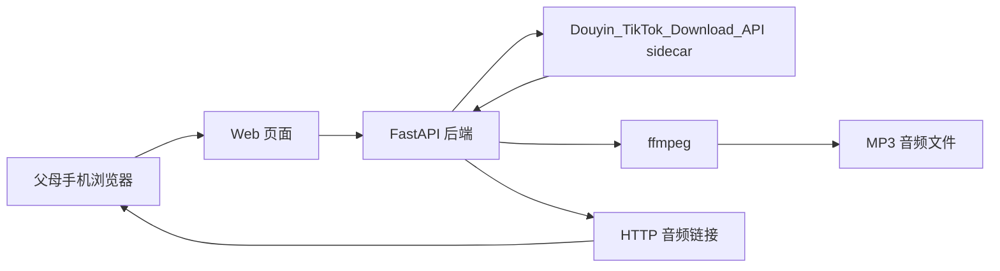
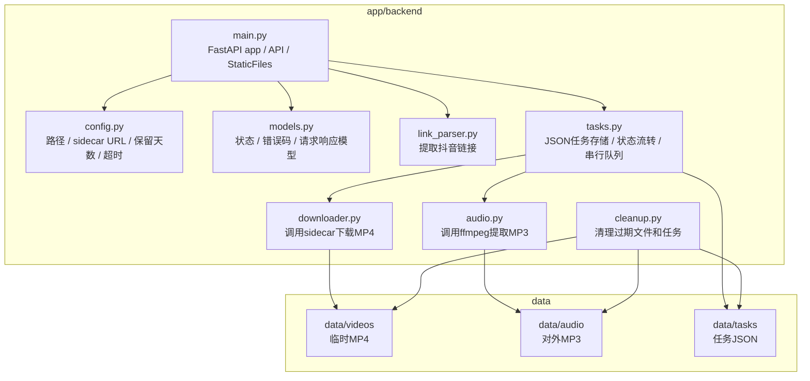
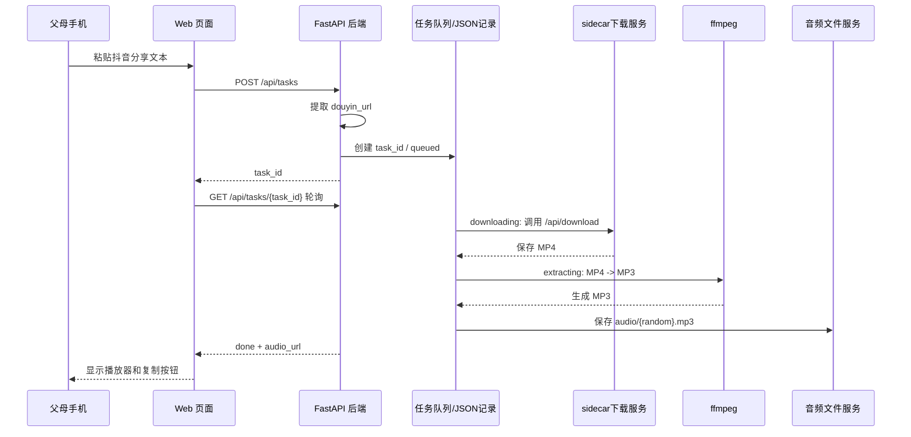
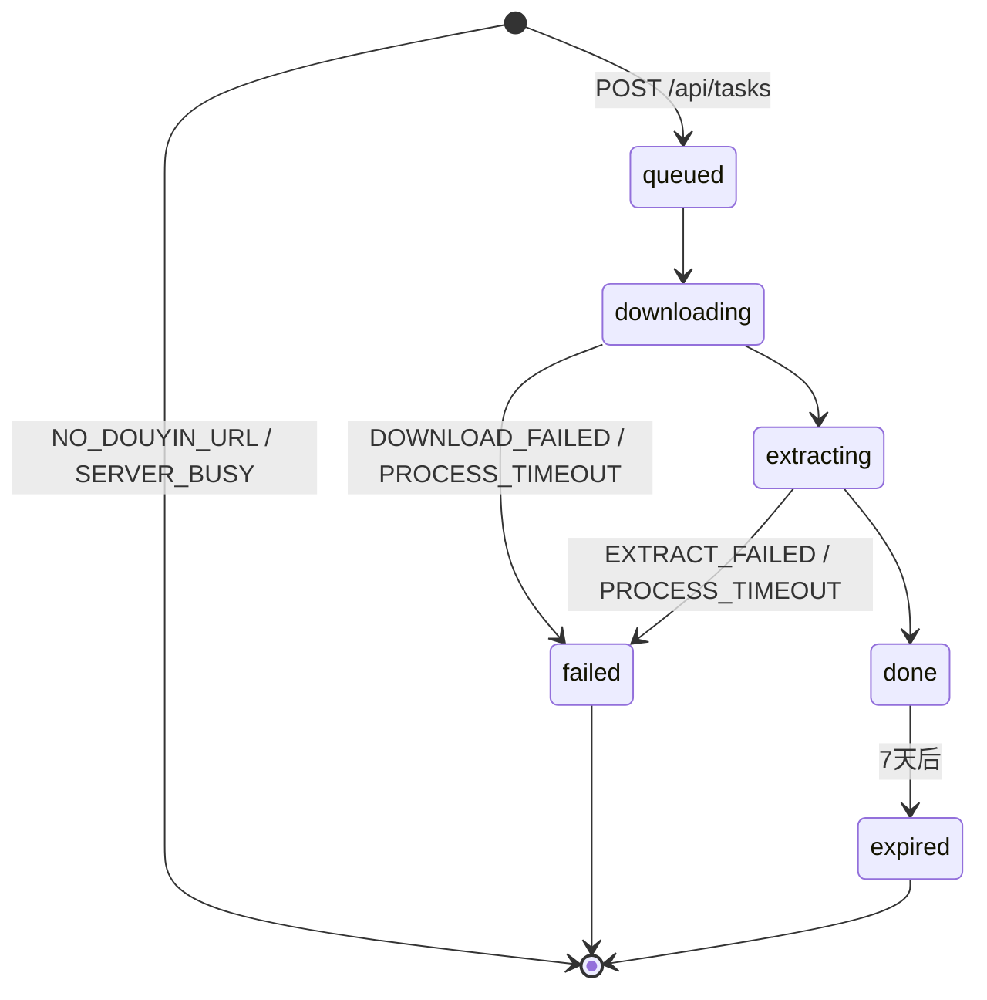

# System Design V1

## 目标

支持 MVP V1：

```text
父母粘贴抖音分享文本
-> 系统下载视频
-> 提取音频
-> 返回 HTTP 音频链接
```

## 总体结构

```text
手机浏览器
  -> Web 页面
  -> FastAPI 后端
  -> 抖音下载工具
  -> ffmpeg
  -> 音频文件
  -> HTTP 链接
```



## 模块

| 模块 | 职责 |
|---|---|
| Web 页面 | 提供大输入框、提交按钮、处理状态、音频链接 |
| API 服务 | 接收分享文本、创建处理任务、返回结果 |
| 链接解析 | 从分享文本中提取抖音短链接 |
| 下载服务 | 根据抖音链接下载视频；V1 先以 `Douyin_TikTok_Download_API` sidecar 方式做 POC |
| 音频服务 | 调用 ffmpeg 提取音频 |
| 文件服务 | 保存音频文件并提供 HTTP 访问 |
| 记录服务 | 记录处理步骤、错误和结果 |

## 正式后端工程设计

V1 正式后端只做最小闭环，不复制 `.poc` 候选项目代码。

推荐目录：

```text
app/backend/
  main.py
  config.py
  models.py
  link_parser.py
  tasks.py
  downloader.py
  audio.py
  cleanup.py
  data/
    videos/
    audio/
    tasks/
  tests/
```



模块职责：

| 文件 | 职责 |
|---|---|
| `main.py` | FastAPI app、API 路由、`/files/audio` 静态文件挂载 |
| `config.py` | 路径、sidecar URL、保留天数、超时、队列大小 |
| `models.py` | 任务状态、错误码、请求/响应模型 |
| `link_parser.py` | 从 `share_text` 提取第一个抖音链接 |
| `tasks.py` | JSON 任务存储、状态流转、串行处理队列 |
| `downloader.py` | 调用本机 sidecar `/api/download`，保存 MP4 |
| `audio.py` | 调用 `ffmpeg` 从 MP4 提取 MP3 |
| `cleanup.py` | 清理过期音频、临时视频和任务记录 |

数据目录：

| 目录 | 用途 |
|---|---|
| `data/videos/` | 临时 MP4，处理成功后删除 |
| `data/audio/` | 对外暴露的 MP3 |
| `data/tasks/` | 每个任务一个 JSON 记录 |

V1 不使用数据库。任务记录以 JSON 文件保存：

```text
data/tasks/{task_id}.json
```

V1 使用进程内串行队列：

- 1 CPU 下不做多线程并发处理。
- 进程内只启动 1 个后台 worker。
- 同一时间只处理一个下载/提取任务。
- 不设置等待队列；如果已有任务正在处理，新的 `POST /api/tasks` 直接返回 `503 SERVER_BUSY`。
- 进程重启不做复杂恢复；启动时可将非终态任务标记为 `failed` / `INTERNAL_ERROR`。

文件策略：

- `videos/{task_id}.mp4` 是临时文件。
- MP3 成功后删除对应 MP4。
- `audio/{random_token}.mp3` 对外访问。
- `audio_url` 返回相对路径：`/files/audio/{random_token}.mp3`。
- MP3 文件名必须不可猜。
- 音频和任务记录默认保留 7 天。

sidecar 边界：

- 正式后端只通过 `SIDECAR_BASE_URL` 调用本机 sidecar。
- 默认候选：`http://127.0.0.1:7000`。
- 调用路径：`/api/download?url=...&prefix=true&with_watermark=false`。
- sidecar URL、Cookie、内部端口、内部路径和 ffmpeg 命令不得返回给前端。
- Cookie 只存在 sidecar 私有配置中，不进入正式工程、仓库或 trace。

实现阶段：

1. 后端骨架、API、JSON 任务存储、单测。
2. mock downloader + ffmpeg 本地文件集成测试。
3. 接真实 sidecar，跑测试1到 HTTP MP3 链接。

每一阶段都必须单独验收，不一次性扩大工程范围。

## 数据流

```text
share_text
-> douyin_url
-> sidecar_download_api
-> video_file
-> audio_file
-> audio_url
```



## 下载方案 POC

已确认的技术方向：

- 下载能力先以 `Douyin_TikTok_Download_API` 作为本机 sidecar 服务做 POC。
- POC 通过前，该项目只作为候选方案，不作为最终架构事实。
- 当前主线优先验证下载链路；UI/API 暂时冻结在设计和 mock/契约层，不提前扩完整工程。
- POC 顺序为：先本机 POC，再 Debian VM POC。
- POC 通过标准是：测试1链接下载到非空 mp4，`ffmpeg` 成功提取音频，音频文件可播放。
- 不能只以 API 返回 200 作为通过标准。
- 我们自己的 FastAPI 后端负责接收分享文本、提取抖音链接、调用 sidecar 下载视频、调用 ffmpeg 提取音频。
- sidecar 只应暴露给本机后端访问，不作为老人端直接访问入口。
- Douyin Cookie 是 POC 前置条件，不能写入代码仓库，也不能写入 learning trace。
- 测试1进入 MVP V1 下载链路验证；测试2继续作为 backlog，不进入 V1。

当前 POC 结果：

- 本机 MP4 下载 POC 已通过。
- 测试1链接可解析出 `aweme_id`。
- 测试1链接可下载为非空 MP4。
- `file` 可识别为 MP4。
- `ffmpeg -i` 只读检查可识别视频流和音频流。
- W 已人工确认 MP4 可正常播放。
- 本机 MP3 提取 POC 已通过。
- 已从测试1 MP4 提取出 `test1.mp3`。
- `file` 可识别为 MP3 音频。
- `ffmpeg` 可完整解码 MP3，时长约 11 分 45 秒，44.1kHz stereo。
- 本机下载加音频提取链路已通过；HTTP 音频链接和服务器部署尚未验证。

## API 草案

### `POST /api/tasks`

输入：

```json
{
  "share_text": "抖音分享文本"
}
```

成功输出 `201 Created`：

```json
{
  "task_id": "T8K3F2A9",
  "status": "queued",
  "audio_url": null,
  "error_code": null,
  "message": "已开始处理"
}
```

如果没有识别到抖音链接，返回 `422`，不创建任务：

```json
{
  "task_id": null,
  "status": null,
  "error_code": "NO_DOUYIN_URL",
  "message": "没有找到抖音链接，请重新复制分享文本"
}
```

如果已有任务正在处理，服务忙，返回 `503`，不创建任务：

```json
{
  "task_id": null,
  "status": null,
  "error_code": "SERVER_BUSY",
  "message": "现在处理的人有点多，请稍后再试"
}
```

### `GET /api/tasks/{task_id}`

成功完成输出 `200`：

```json
{
  "task_id": "T8K3F2A9",
  "status": "done",
  "audio_url": "/files/audio/8f7a...c2.mp3",
  "error_code": null,
  "message": "处理好了，点击下面链接播放"
}
```

V1 使用 `POST /api/tasks` 提交任务，再由前端轮询 `GET /api/tasks/{task_id}`。

`audio_url` 对前端返回相对路径，例如 `/files/audio/xxx.mp3`。前端可直接用于播放；如果后续需要复制完整外部链接，再由前端或后端拼接域名。

`task_id` 使用 8-10 位大写字母数字短随机 ID，方便 W 通过截图、电话或微信排查。

如果任务不存在，返回 `404`，响应体仍保持稳定错误码：

```json
{
  "task_id": "T8K3F2A9",
  "status": null,
  "audio_url": null,
  "error_code": "TASK_NOT_FOUND",
  "message": "没有找到这次任务，请重新提交"
}
```

如果任务已创建但处理失败，查询接口仍返回 `200`，由 `status: failed` 和 `error_code` 表示业务失败：

```json
{
  "task_id": "T8K3F2A9",
  "status": "failed",
  "audio_url": null,
  "error_code": "DOWNLOAD_FAILED",
  "message": "这次没有处理成功，请换一个视频试试"
}
```

如果任务或音频已过期，返回 `200`，状态为 `expired`：

```json
{
  "task_id": "T8K3F2A9",
  "status": "expired",
  "audio_url": null,
  "error_code": "TASK_EXPIRED",
  "message": "这个链接已经过期，请重新提取一次"
}
```

如果查询阶段服务暂时繁忙，可返回 `503 SERVER_BUSY`，前端提示稍后再试，但不应丢失当前任务号。

## 任务记录

每个已创建任务保存一个 JSON 文件：

```text
data/tasks/{task_id}.json
```

任务记录只保存 `share_text_preview`，不保存完整 `share_text`。`share_text_preview` 最多 80 字，用于 W 排查，避免长期落盘完整分享文本。

示例：

```json
{
  "task_id": "T8K3F2A9",
  "status": "queued",
  "created_at": "2026-05-04T01:00:00+08:00",
  "updated_at": "2026-05-04T01:00:00+08:00",
  "expires_at": "2026-05-11T01:00:00+08:00",
  "share_text_preview": "4.30 复制打开抖音...",
  "douyin_url": "https://v.douyin.com/iNVnLqYO4FQ/",
  "video_path": "data/videos/T8K3F2A9.mp4",
  "audio_path": "data/audio/7t3Kp9QmR2xA.mp3",
  "audio_url": "/files/audio/7t3Kp9QmR2xA.mp3",
  "error_code": null,
  "error_detail": null,
  "stage_timestamps": {
    "queued_at": "2026-05-04T01:00:00+08:00",
    "downloading_at": null,
    "extracting_at": null,
    "done_at": null,
    "failed_at": null
  }
}
```

`error_detail` 只用于本地排查，不返回老人端。它不得包含 Cookie、完整 traceback、服务器凭据或其他敏感信息。

## 任务状态

| 状态 | 含义 |
|---|---|
| `queued` | 已创建任务 |
| `downloading` | 正在下载视频 |
| `extracting` | 正在提取音频 |
| `done` | 已完成 |
| `failed` | 处理失败 |
| `expired` | 任务或音频已过期 |



前端 UI 状态映射：

| UI 状态 | 后端状态 |
|---|---|
| 初始输入 | 无 API 调用 |
| 输入后可提交 | 前端本地状态 |
| 处理中 | `queued` / `downloading` / `extracting` |
| 成功 | `done` |
| 失败 | `failed` / `TASK_NOT_FOUND` |
| 任务过期 | `expired` / `TASK_EXPIRED` |
| 未识别链接 | `NO_DOUYIN_URL` |
| 服务忙 | `SERVER_BUSY` |

## 错误码

| 错误码 | 老人端文案 |
|---|---|
| `NO_DOUYIN_URL` | 没有找到抖音链接，请重新复制分享文本 |
| `UNSUPPORTED_URL` | 没有找到抖音链接，请重新复制分享文本 |
| `DOWNLOAD_FAILED` | 这次没有处理成功，请换一个视频试试 |
| `EXTRACT_FAILED` | 这次没有处理成功，请换一个视频试试 |
| `SERVER_BUSY` | 现在处理的人有点多，请稍后再试 |
| `PROCESS_TIMEOUT` | 处理时间太久了，请稍后再试 |
| `TASK_NOT_FOUND` | 没有找到这次任务，请重新提交 |
| `TASK_EXPIRED` | 这个链接已经过期，请重新提取一次 |
| `INTERNAL_ERROR` | 这次没有处理成功，请换一个视频试试 |

任务处理超过 V1 设定的最长处理时间时，后端应将任务转为 `failed`，错误码为 `PROCESS_TIMEOUT`。

## 文件策略

- 音频文件使用随机文件名。
- 默认保留 7 天。
- V1 不做账号系统。
- V1 可先用不可猜测链接降低误访问风险。
- 过期或不存在的 `/files/audio/{filename}` 返回 `404`。
- 查询已过期任务时，业务 API 返回 `status: expired` 和 `TASK_EXPIRED`，用于前端显示可理解文案。

## W 排查日志

每个已创建任务至少记录：

- 任务号。
- 创建时间。
- 原始输入是否识别到抖音链接。
- 规范化后的抖音链接。
- 当前状态。
- 错误码。
- 关键阶段耗时。
- 音频文件名。
- 过期时间。

后端日志可以记录 sidecar 调用结果、ffmpeg 返回码和服务端文件路径。

禁止返回给老人端 UI：

- Cookie。
- sidecar 端口或完整内部 URL。
- 服务端真实目录。
- ffmpeg 命令细节。
- Python traceback。

## 错误处理

需要向用户展示清楚的错误：

- 未识别到抖音链接。
- 下载失败。
- ffmpeg 提取失败。
- 服务器忙或资源不足。

## V1 不做

- 不做自动搜索。
- 不做变调。
- 不做账号。
- 不做复杂任务队列。
- 不做多人权限系统。

## 后续扩展

- 增加任务历史。
- 增加 rubberband 变调。
- 增加自动搜索候选视频。
- 增加后台清理任务。
