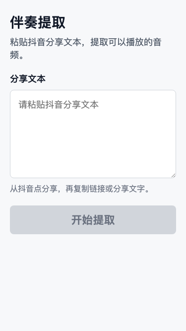
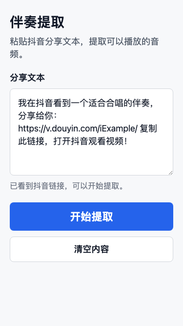
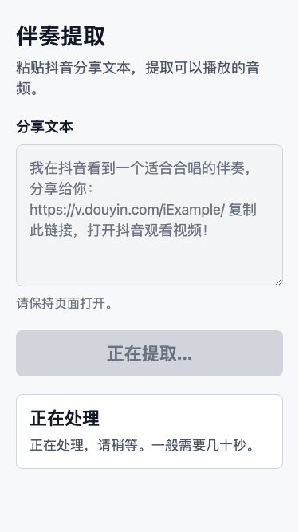
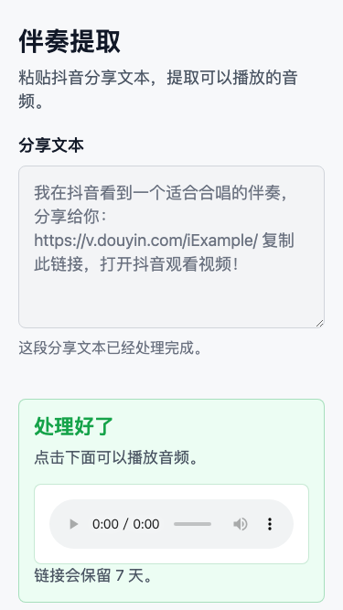
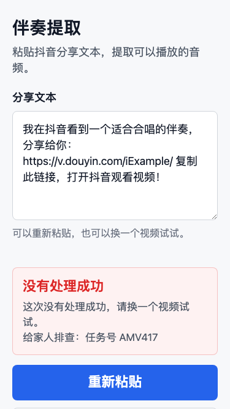
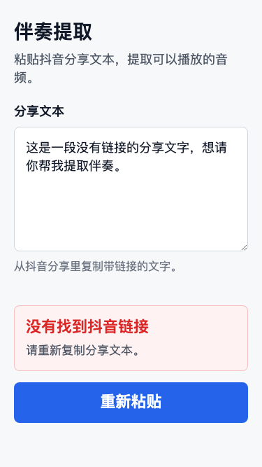

# Learning Trace: 从家庭需求到可验证的软件任务

## 这篇记录什么

这个阶段做了两件事：

- 把一个家庭里的真实需求，拆成产品、实现、测试三个方向。
- 用多个 agent session 并行工作，同时保证 W 仍然做最终判断。

项目目标有两个：

- 做一个给父母使用的伴奏提取网页。
- 记录人和 agent 如何协作，给女儿学习参考。

## 起点：不要直接写代码

W 的父母经常需要伴奏。原来的人工流程是：

```text
找抖音视频
-> 下载视频
-> 用 ffmpeg 提取音频
-> 发给父母
```

我们把 V1 收敛成：

```text
父母在手机网页粘贴抖音分享文本
-> 系统下载视频
-> 提取音频
-> 返回可播放链接
```

这一步最重要的不是技术，而是范围控制。

## 先设计 agent 协作机制

一开始，M 误以为“派活”是 fork 当前 session 里的 subagent。

W 纠正：不是 fork，而是 M 给出固定 prompt，W 手动贴给其他 session 里的角色。

于是我们定义了角色：

| 角色 | 职责 |
|---|---|
| M | 主控，和 W 对话，拆任务，回收结果，整合决策 |
| P | 产品，负责范围、交互、文案、视觉规格 |
| I | 实现，负责代码、POC、调试 |
| Q | 验证，负责验收标准、失败模式、测试矩阵 |

也定义了固定格式：

```text
P-BOOT / I-BOOT / Q-BOOT
P-TASK / I-TASK / Q-TASK
P-R / I-R / Q-R
```

这里的学习点是：

> 多 agent 协作里，prompt 是接口协议，不是随手写的聊天。

## 控制 MVP：测试1进 V1，测试2进 backlog

W 提供了两个测试想法：

```text
测试1：下载一个具体抖音链接
测试2：搜索歌名，下载首位视频
```

P 判断：

- 测试1是主链路：已知链接 -> 下载视频 -> 提取音频。
- 测试2是新产品能力：搜索 -> 选择 -> 下载。

W 确认：

```text
测试1进入 MVP V1
测试2进入 backlog
老人端 V1 只保留粘贴分享文本单入口
```

这里的学习点是：

> MVP 的关键不是“能不能做”，而是“现在该不该做”。

## 最高风险：先验证 MP4 下载

W 提醒：

> 如果视频下载技术过不去，其他都是白做。

于是当前主线切到下载 POC：

```text
test1 抖音链接
-> 下载出非空 MP4
-> 文件确实是视频
-> W 能人工播放
```

注意，API 返回 200 不算通过。真正的通过标准是拿到可播放视频。

这里的学习点是：

> 技术预研要验证真正风险，不要用表面的成功代替闭环成功。

## 并行推进：UI mock 不等下载 POC

下载 POC 由一个 I session 做。

同时，另一个 I session 做静态 UI mock。这个 mock 不接后端、不下载视频，只验证父母看到的页面是否清楚。

UI mock 文件：

```text
.poc/ui-mock/index.html
```

它支持六个状态：

```text
?mock=idle
?mock=filled
?mock=processing
?mock=success
?mock=error
?mock=no-link
```

W 打开后确认：可以。

这里的学习点是：

> mock 不是假装产品完成，而是用最低成本验证某一类风险。

## UI 状态截图

下面是 iPhone SE 尺寸下的六个状态截图。

### 1. 初始输入



### 2. 输入后可提交



### 3. 处理中



### 4. 成功



### 5. 通用失败



### 6. 未识别链接



同时还生成了 Android 360px 宽度截图，放在：

```text
07_traces/tutorials/assets/ui-mock-v1/
```

## Q 为什么提前写测试矩阵

Q 在两个 I session 还没完全结束时，就准备了验收矩阵。

它要求 UI mock 不能只说“页面做好了”，还要检查：

- 六个状态是否都能打开。
- 成功页播放器是否优先。
- 失败页是否隐藏技术错误。
- no-link 是否不显示任务号。
- 页面是否出现搜索、登录、变调、历史列表等 V1 禁止项。

它也要求 MP4 POC 不能只说“下载成功”，必须提供：

- MP4 绝对路径。
- 文件大小。
- 文件类型检查。
- W 人工播放反馈。

这里的学习点是：

> 好的 QA 不是最后找 bug，而是在实现前定义什么叫成功。

## 人如何持续纠正 agent

这个阶段 W 多次纠正 M：

- 不要 fork subagent，要给可复制 prompt。
- worker 是有状态 session，新 session 由 W 决定。
- BOOT 和 TASK 不要重复。
- 不要忘记女儿 learning trace。
- 本项目临时文件也不能离开项目目录。
- P 不做实现，I 才做 clone 和 POC。

这些不是打断，而是在设计更可靠的协作系统。

这里的学习点是：

> 人不是只负责批准结果，还负责校正 AI 的工作方式。

## 敏感信息边界

下载 POC 需要 Douyin Cookie。

我们规定：

- Cookie 不进聊天。
- Cookie 不进仓库。
- Cookie 不进 trace。
- Cookie 只放在 `.poc/` 下候选项目的本地配置里。

这里的学习点是：

> 可学习不等于全公开。trace 要记录判断和过程，但不能泄露敏感信息。

## 当前状态

已完成：

- 多 session agent 协作机制。
- MVP V1 边界。
- UI 视觉规格。
- 静态 UI mock。
- UI mock 截图。
- API 契约。
- 测试矩阵。
- 本机 MP4 下载 POC 准备。

正在进行：

- I 等待 W 配置 Cookie 后继续 MP4 下载 POC。

还没完成：

- MP4 下载是否真正成功。
- MP3 提取链路。
- 正式前后端工程。
- 真实 API 和任务队列。
- 服务器部署。

## 总结

这个阶段最重要的不是写了多少代码，而是把模糊需求变成了可验证任务。

我们不断问：

- 第一版只做什么？
- 最高风险是什么？
- 哪些任务可以并行？
- 谁负责产品、实现、验证？
- 什么叫做通过？
- 哪些信息不能记录？

这就是软件工程里的系统化思考。
