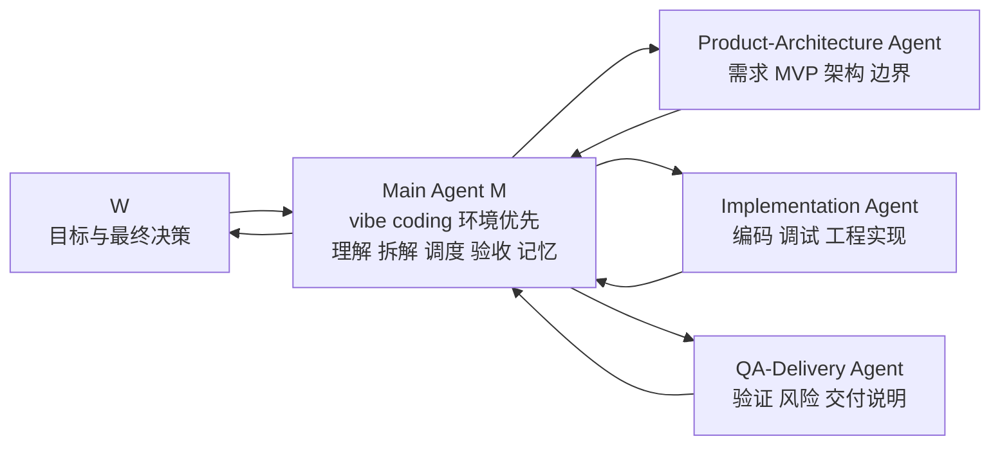
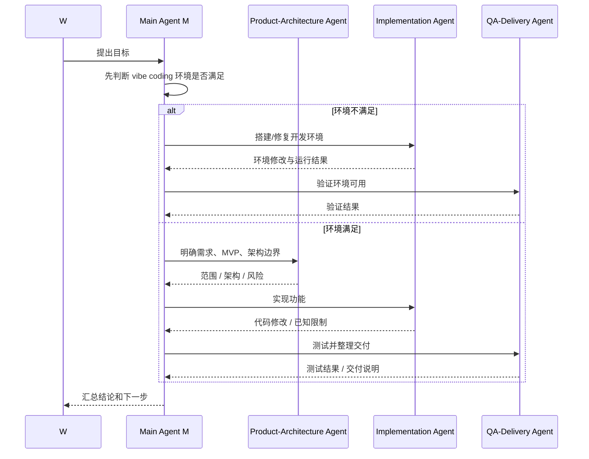
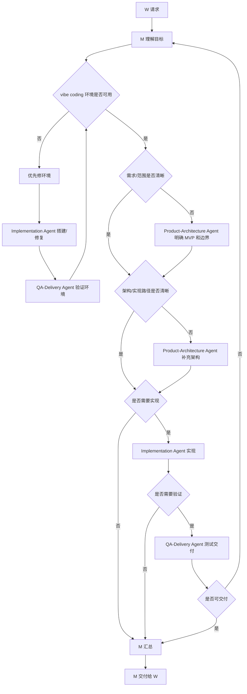

# Agent 角色解构图表

## 1. 简化后角色结构

应用比较简单，worker 不宜过细。V1 采用 `1 个 Main Agent + 3 个 Worker Agent`。

## 2. M 的优先级

| 优先级 | M 的职责 | 说明 |
|---:|---|---|
| P0 | 搭建和维护 vibe coding 环境 | 优先级高于开发具体应用 |
| P1 | 理解 W 的目标并拆解任务 | 保证任务可执行 |
| P2 | 调度 worker agent | 按任务选择最少必要 worker |
| P3 | 验收结果并维护记忆 | 控制质量和上下文连续性 |
| P4 | 推进手机应用开发 | 在环境稳定后执行 |

## 3. 标准协作链路

## 4. 角色职责矩阵

| 角色 | 定位 | 核心职责 | 主要输出 | 不负责 |
|---|---|---|---|---|
| W | 系统所有者 | 提目标、定方向、做取舍、最终决策 | 目标、优先级、确认意见 | 低层重复执行 |
| Main Agent M | 总控 + vibe coding 环境负责人 | 环境优先、理解、拆解、调度、验收、记忆维护 | 环境状态、任务拆解、分派、汇总、交付结论 | 跳过环境直接堆应用 |
| Product-Architecture Agent | 需求与结构 agent | 明确 MVP、用户场景、功能边界、模块结构、技术风险 | MVP 范围、功能清单、架构边界、验收标准 | 写完整代码、替代验证 |
| Implementation Agent | 实现 agent | 搭建环境、编码、调试、修改工程文件 | 可运行环境、代码修改、运行说明、已知限制 | 擅自改需求、自证质量 |
| QA-Delivery Agent | 验证与交付 agent | 测试、回归、风险判断、交付整理 | 测试结果、风险列表、交付摘要、运行说明 | 隐藏风险、替代实现 |

## 5. 输入输出矩阵

| 角色 | 输入 | 输出 |
|---|---|---|
| W | 交付结果、风险、建议 | 目标、约束、优先级、确认 |
| Main Agent M | W 请求、上下文、记忆、worker 结果 | 环境决策、task context、调度决策、汇总结论、记忆更新 |
| Product-Architecture Agent | 目标、项目背景、约束 | MVP、功能范围、模块边界、验收标准、架构风险 |
| Implementation Agent | 明确任务、文件范围、完成标准、环境目标 | 环境配置、代码修改、运行结果、已知限制 |
| QA-Delivery Agent | 实现结果、验收标准、运行方式 | 测试结果、缺陷风险、交付说明、下一步建议 |

## 6. 权限矩阵

| 能力 / 角色 | W | M | Product-Architecture | Implementation | QA-Delivery |
|---|---:|---:|---:|---:|---:|
| 决定方向 | 是 | 建议 | 否 | 否 | 否 |
| 决定环境优先级 | 确认 | 是 | 否 | 执行 | 验证 |
| 拆解任务 | 可 | 是 | 局部 | 否 | 否 |
| 分派 agent | 否 | 是 | 否 | 否 | 否 |
| 设计 MVP | 确认 | 是 | 是 | 建议 | 建议 |
| 设计架构 | 确认 | 是 | 是 | 建议 | 风险建议 |
| 修改代码/环境 | 否 | 可分派 | 否 | 是 | 仅被分派时 |
| 验证结果 | 可 | 是 | 验收口径 | 自查 | 是 |
| 更新长期记忆 | 确认 | 是 | 建议 | 建议 | 建议 |
| 最终交付 | 接收 | 是 | 否 | 否 | 整理 |

## 7. 上下文读取范围

| 角色 | 必读上下文 | 可读上下文 | 写入位置 |
|---|---|---|---|
| Main Agent M | Global / Project / Task / Memory / 环境状态 | 全部相关上下文 | `memory/*`、`outputs/*`、任务文档 |
| Product-Architecture Agent | Global / Project / Task | 用户场景、历史需求、技术约束 | 需求与架构结果，建议写入 memory |
| Implementation Agent | Task / Architecture 输出 / 环境目标 | 相关代码、配置、运行日志 | 工程文件、实现说明、环境记录 |
| QA-Delivery Agent | Task / 验收标准 / 实现结果 / 环境状态 | 测试记录、风险记忆 | 测试结果、交付说明、风险建议 |

## 8. M 的决策流

## 9. 合并理由

| 原角色 | 处理方式 | 理由 |
|---|---|---|
| Product Agent | 合并进 Product-Architecture | 简单应用中需求和结构强相关 |
| Architecture Agent | 合并进 Product-Architecture | 避免过度设计和沟通成本 |
| Implementation Agent | 保留 | 环境和代码执行是核心工作 |
| QA Agent | 合并进 QA-Delivery | 简单应用中验证和交付可连续完成 |
| Delivery Agent | 合并进 QA-Delivery | 交付说明依赖验证结果 |

## 10. 核心结论

| 关键点 | 结论 |
|---|---|
| 当前角色规模 | 1 个 M + 3 个 worker |
| M 的第一职责 | vibe coding 环境搭建和维护 |
| 应用开发优先级 | 低于环境稳定性 |
| worker 策略 | 少而清晰，避免过度分工 |
| 成败关键 | M 先保证环境，再调度开发 |

